# InfracubatorAssignments

## Assignment-1

1. Start an nginx container.
2. Port forward to local and check.
3. Check logs.
4. Go inside the container.
5. Stop the container.

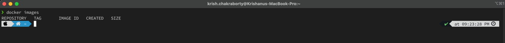

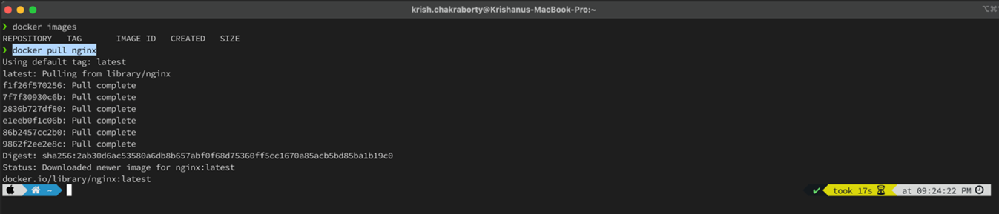

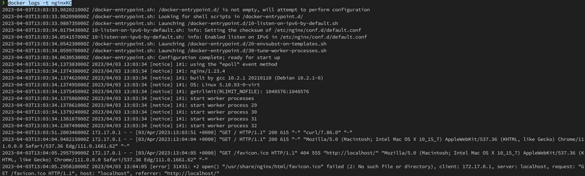

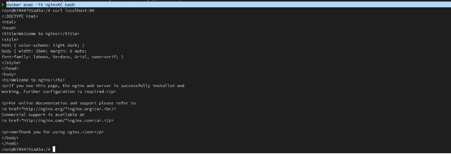

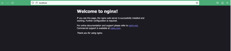

## Assignment-2

Given that you have instructions to run the go-app (in pre-requisites)
1. Try to create a docker image out of it with the base image of golang:alpine
2. Run a container with that image and do a curl a request and make sure you are able to see the output.
3. Tag the docker image with v1.
4. Run docker history, observe and understand the output.
5. Push the docker image to your dockerhub.

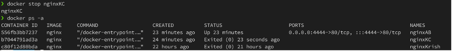

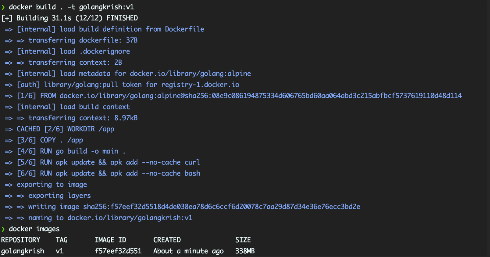

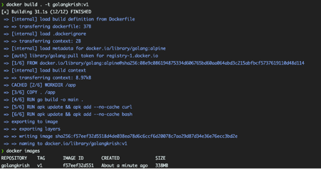

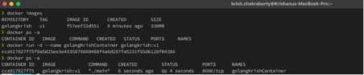

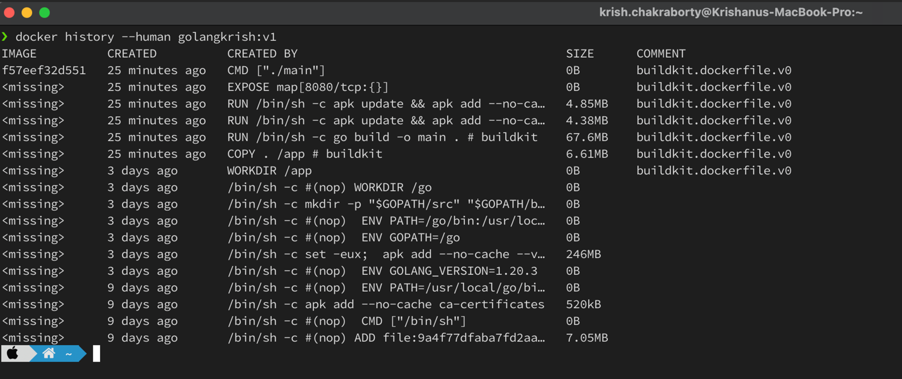

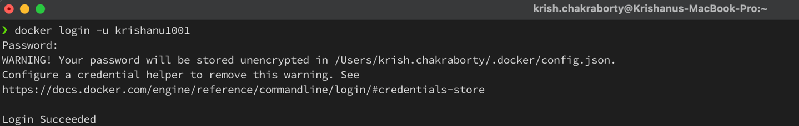

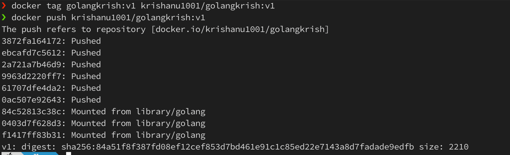

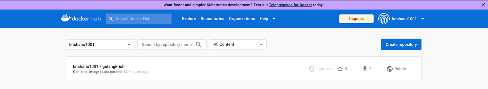

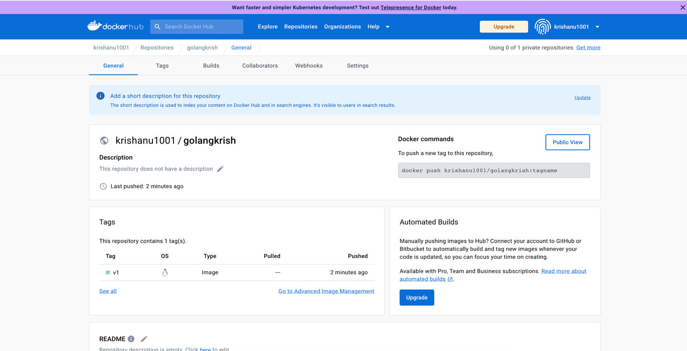

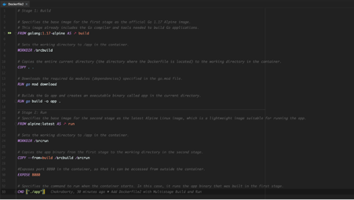

## Assignment-3
1. Create multistage build and run Dockerfile for go -app
- Stage 1 : Build
- Stage 2 : Run

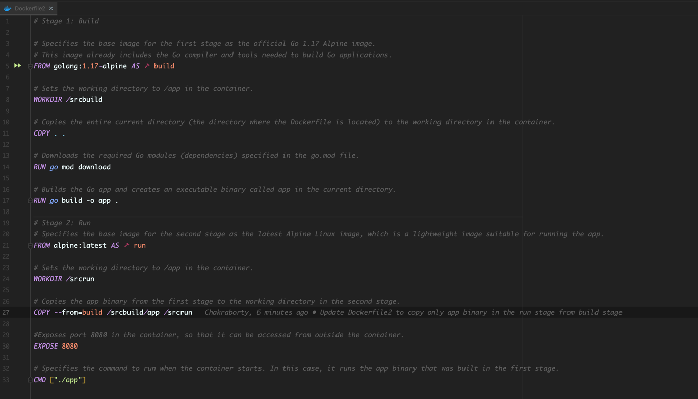

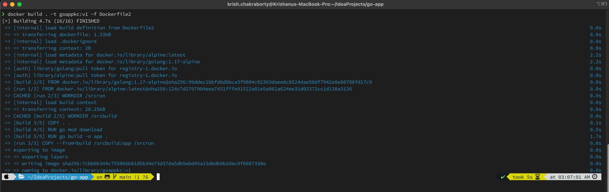

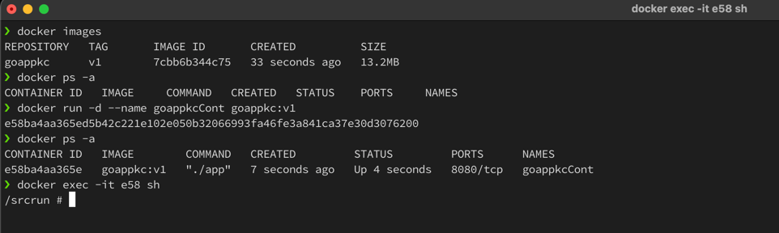

## Assignment-4
1. Create  a volume  call it as my-volume
2. Create a container and attach it to my-volume
3. Change something in the volume folder and add a file with some content.
4. Create a second container mounted with same volume . Check if the file exists or not.

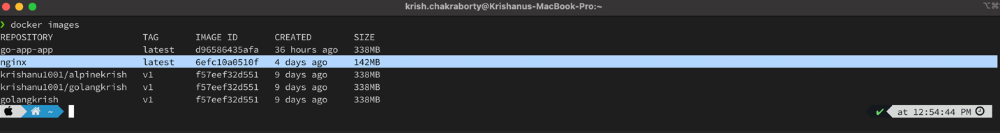

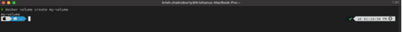

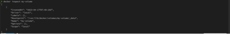

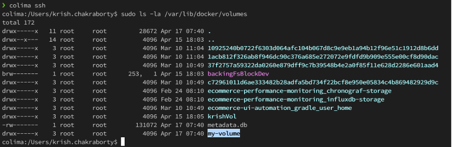

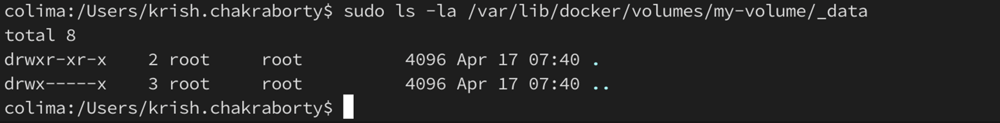

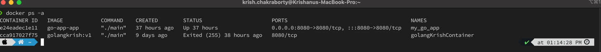

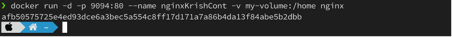

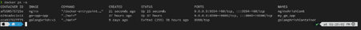

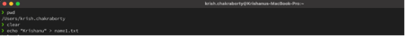

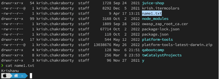

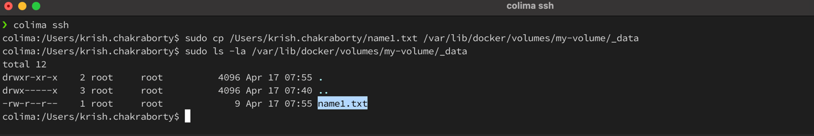

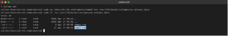

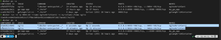

## Assignment-5
1. Create docker-compose file for go-app
2. docker-compose up
3. Use / endpoint to check the service running
4. Use /vote endpoint to add vote
5. docker-compose down

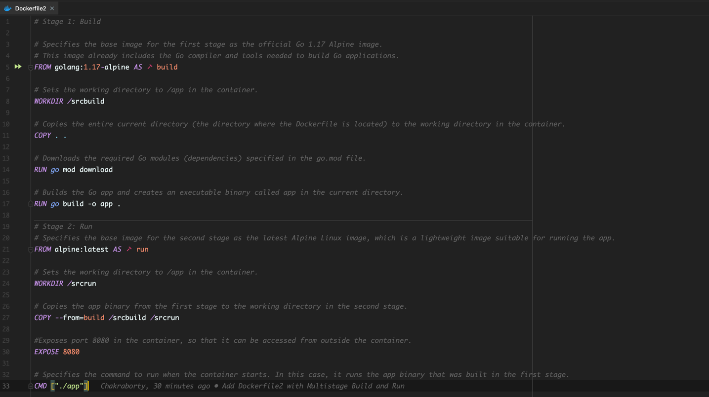

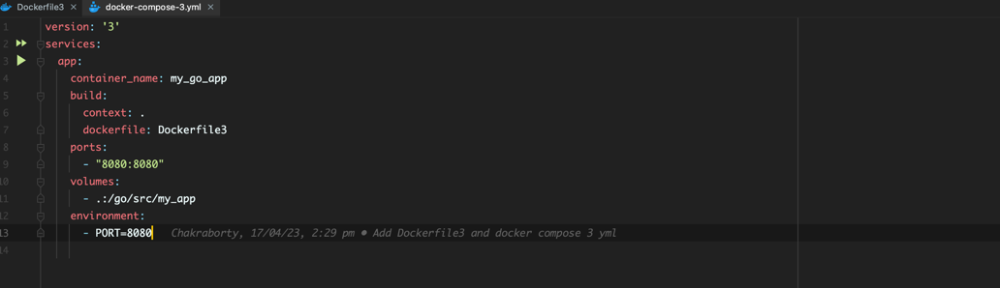

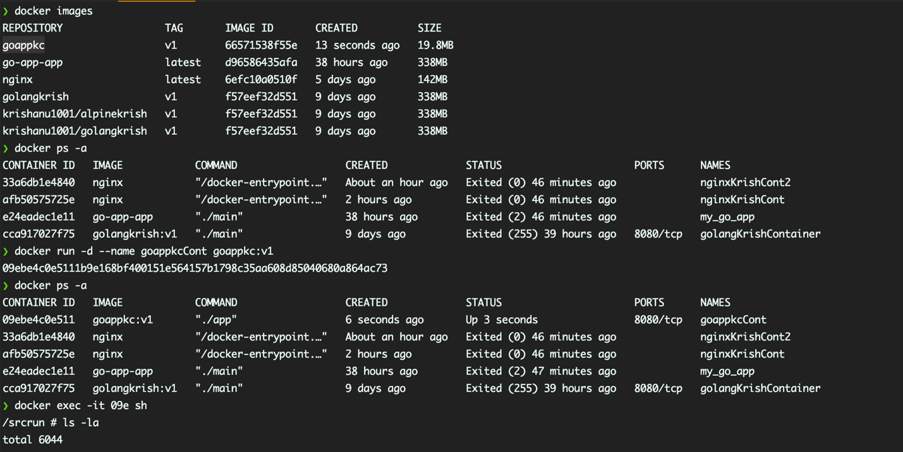

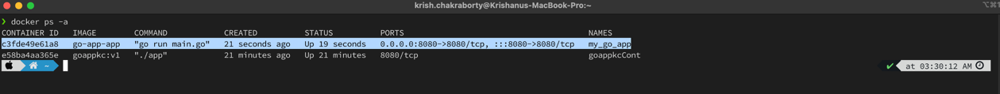

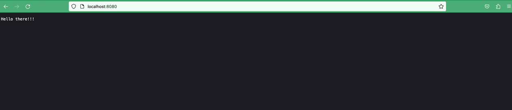

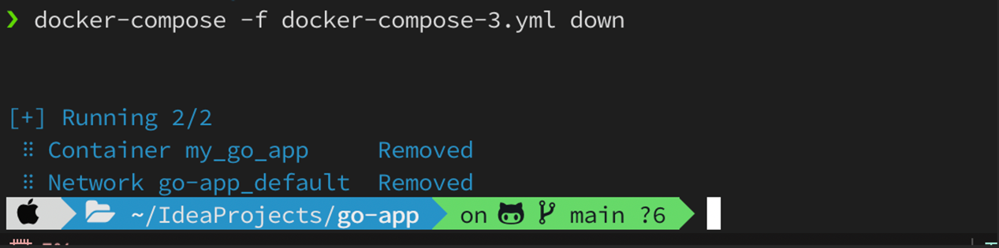

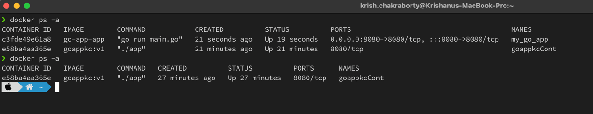

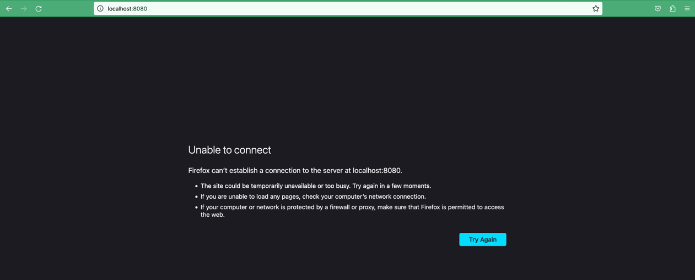
